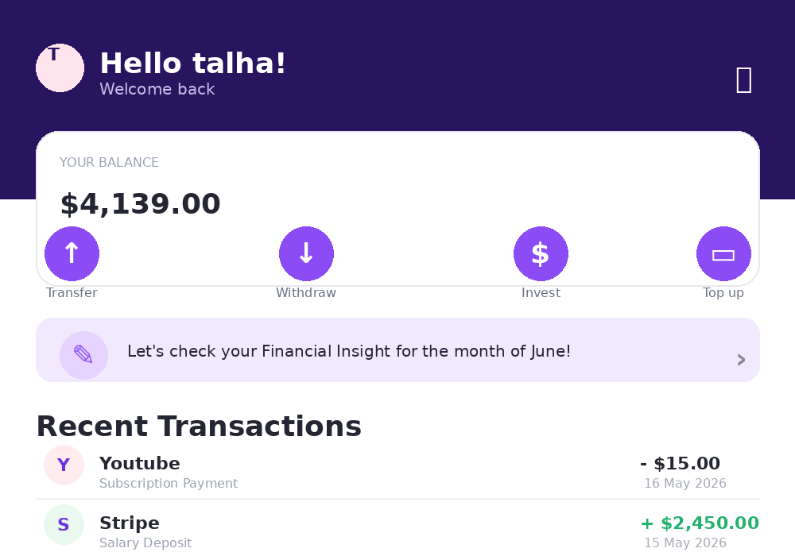

# Walleta app

Hafta 16 ödevi için hazırlanmış temiz Expo Router finansal cüzdan uygulaması.



## Kurulum

```bash
npm install
npm run web
```

Expo Go ile açmak için:

```bash
npm start
```

## Kullanılan Konular

- Context API ile kullanıcı oturumu
- AsyncStorage ile kullanıcı + tema kalıcılığı
- Expo Router Stack + Tabs
- 5 sekmeli navigation
- Ortadaki özel FAB butonu ile transaction ekleme ekranı
- Dinamik route: `app/transaction/[id].tsx`
- React Query: `useQuery`, `useMutation`, `invalidateQueries`
- Firebase Firestore servisleri: `getDocs`, `getDoc`, `addDoc`, `updateDoc`, `deleteDoc`
- NativeWind konfigürasyonu
- FlatList ile transaction listesi

## Firebase Ayarı

`utils/firebaseConfig.ts` dosyası teslim şartına uygun şekilde boş bırakılmıştır.

Kendi Firebase projenizi bağlamak için şu alanları doldurun:

```ts
export const firebaseConfig = {
  apiKey: '',
  authDomain: '',
  projectId: '',
  storageBucket: '',
  messagingSenderId: '',
  appId: ''
};
```

Config boşken uygulama local AsyncStorage fallback ile çalışır. Bu sayede proje ilk açılışta patlamaz. Config doldurulursa Firestore `transactions` collection'ı kullanılır.

## Ekranlar

- `app/login.tsx`: isim + email login ekranı
- `app/(tabs)/index.tsx`: mockup'a yakın Walleta home ekranı
- `app/transaction/add.tsx`: yeni transaction ekleme
- `app/transaction/[id].tsx`: transaction detay, düzenleme, silme
- `app/(tabs)/card.tsx`: placeholder
- `app/(tabs)/stat.tsx`: placeholder
- `app/(tabs)/profile.tsx`: kullanıcı bilgisi + çıkış yap

## Transaction Veri Modeli

```ts
export type Transaction = {
  id: string;
  title: string;
  subtitle: string;
  amount: number;
  type: 'income' | 'expense';
  category: string;
  date: string;
};
```

Firestore tarafında `date` alanı `serverTimestamp()` ile yazılır; uygulamada listeleme için ISO string'e çevrilir.

## Not

`node_modules` zip içine eklenmemiştir. Teslimden sonra projeyi açan kişi önce `npm install` çalıştırmalıdır.
